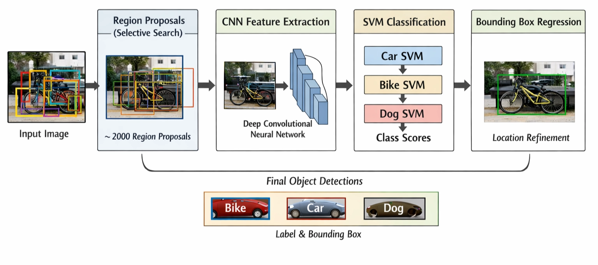
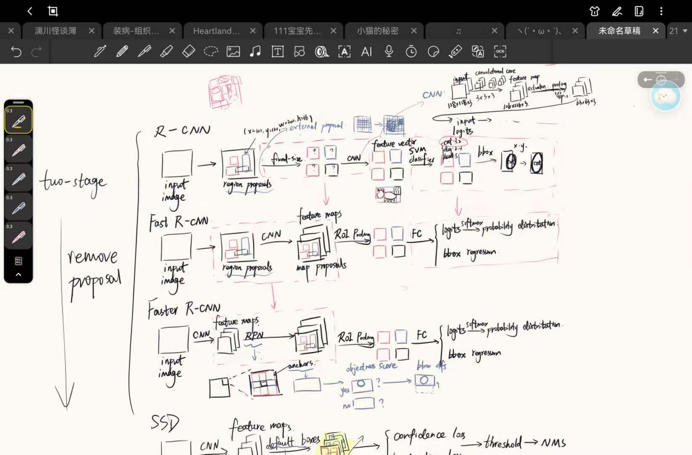

# Reading Note

# **Rich feature hierarchies for accurate object detection and semantic segmentation (R-CNN)**

## Abstract

- backgrounds: in the past few years, object detection algorithms based on traditional manual features such as SIFT and HOG have encountered ***performance bottlenecks and made slow progress.***
- innovation: R-CNN ***combines the bottom-up generated “Region Proposals” with high-capacity convolutional neural network*** for target localization and segmentation.
- breakthrough: propose an ***important training paradigm*** in response to solve the problem of the scarcity of manually labeled data in object detection tasks: conduct supervised pre-training on large auxiliary datasets first, then perform Domain-specific fine-tuning on small datasets in specific domains.

<aside>
💡

The paper proposes R-CNN, which combines region proposals with CNN features for object detection and semantic segmentation. And through the pre-training of large-scale classification datasets and the fine-tuning of detection datasets, the detection accuracy has been significantly improved.

</aside>

## Object Detection with R-CNN

### 1. Module Design

- Region Proposals
    
    The system uses Selective Search to identify category-independent region proposals that may contain objects for each input image.
    
- Feature Extraction
    
    Use a large CNN (AlexNet) to extract 4096-dimensional feature vectors from each candidate region. The paper adopts a straightforward and forceful approach, ignoring the original shape or aspect ratio of the candidate boxes to deform and **wrap** them all to the required fixed size because the CNN architecture requires a fixed input size.
    
- Classifier
    
    Train a linear SVM for binary classification for each category.
    

<aside>
💡

R-CNN separate detection into three modules. Unlike traditional complex multi-feature systems, it replaces manual features with unified deep features.

</aside>

### 2. Test-time Detection

- run selective search on the test image to extract 2000 region proposals
- wrap  each proposal and forward propagate it through the CNN in order to compute features
- score each extracted feature vector using the SVM trained for each class
- apply a greedy non-maximum suppression that rejects a region if it has an intersection-over-union(IoU) overlap with a higher scoring selected region larger than a learned threshold
- run time analysis: Although R-CNN is slow, it has strong category scalability. The truly time-consuming part is running a CNN separately for each proposal which is the key are that Fast R-CNN/Faster R-CNN needs to focus on.

<aside>
💡

R-CNN made a breakthrough in accuracy, but not good at reasoning speed. It’s an early depth detector with high precision and low efficiency.

</aside>

### 3. Training

- supervised pre-training on ILSVRC2012 using image-level annotations only(boundingbox labels are not available)
- domain-specific fine-tuning: replace the CNN’s ImageNet-specific 1000-way classification layers with a randomly initialized (N+1)-way classification layers(N object classes + background)
- object category classifiers: optimize one linear SVM per class after features are extracted and training labels are applied, instead of simply using the outputs from the final softmax layer of the fine-tuned CNN.

<aside>
💡

The author adopts a two-stage training approach: first, pre-trained CNN is supervised on a large-scale classification dataset, and then fine-tuned on the detection data. Finally, used linear SVM as the detector. The strategy alleviated the problem of insufficient detection data.

</aside>

## Workflow

## Visualization, ablation and modes of error

### 1. visualizing learned features

choose a particular unit to compute its activations on a large set of held-out region proposals, finding the highest activation to see how it reacts.

the results show that some units are aligned to concepts(people or text), material properties(dot arrays) and specular reflections

<aside>
💡

the network can learn not only the “category”, but also the materials, colors, texture and local structure

</aside>

### 2. Ablation studies

the author compared the performance layer-by-layer between without fine-tuning and with fine-tuning

Without fine-tuning: fc6 generalizes better than fc7, and pool5 also surprisingly strong

After fine-tuning: the overall improvement is significant, especially in fc6 and fc7. increase mAP by 8 percentage points to 54.2%

<aside>
💡

the ablation experiment show that the pre-trained features of imageNet have a strong transfer ability and fine-tuning for the detection task brings significant gains.

Among them, fc6 and fc7 benefit the most, indicating that high-level nonlinear classification representation requires task adaptation.

</aside>

### 3. Network Architectures

the author used not only AlexNet(T-Net) but also deeper one: OxfordNet/VGG 16(O-Net)

the results show that the deeper networks furthur significantly enhance performance, but at the cost of slower inference, approximately seven times.

### 4. Detection error analysis

the shortage of R-CNN is mislocalization

### 5. Bounding-box Regression

authors implemented this to solve the mislocalization.

train a linear regression model to predict a new detection window given the pool5 features for a selective search region proposal

# Fast R-CNN

Fast R-CNN is to solve the problem of slow, complex and using too much storage of R-CNN, meanwhile to make the detection result better.

improvement: 1. do one convolution calculation each graph, unlike runs a separate CNN each proposal; 2. introduce Rol Pooling to extract fixed-length features for each proposal from shared feature map; 3. training classification and border regression together with multi-task loss turns it into a single-stage end-to-end training.

### Abstract

This paper proposes Fast R-CNN, a fast and accurate object detection framework that improves over R-CNN and SPPnet. It computes convolutional features for the whole image one, uses Rol Pooling for each proposal, and jointly trains classification and bounding-box regression in a single-stage framework.

### Introduction

background: Since deep ConvNets have significantly improved image classification and object detection accuracy, object detection is a more challenging task than image classification due to detection and localization which need to process lots of proposals.

shortage of R-CNN: 1. multi-stage pipeline training(fine-tune CNN → train SVM → train bbox regressor); 2. training is expensive in space and time(extract feature for each proposal); 3. slow detection(run CNN for each proposal).

shortage of SPPnet: 1, 2 same as above; 3: cannot update the convolutional layers, limiting the accuracy of very deep networks.

contributions: 1. higher mAP; 2. single-stage multi-task training; 3. be able to update all network layers; 4. no disk storage is required for feature caching

<aside>
💡

solve the inefficiency and complexity of R-CNN and SPPnet based on region-based detection

</aside>

### Architecture and Training

An input image and multiple regions of interest (RoIs) are input into a fully convolutional network. Each RoI is pooled into a fixed-size feature map and
then mapped to a feature vector by fully connected layers (FCs). The network has two output vectors per RoI: softmax probabilities(k+1) and per-class bounding-box regression offsets(4). The architecture is trained end-to-end with a multi-task loss.

1. The RoI pooling layer
    
    divide an RoI corresponding are into H*W sub-windows → perform max pooling in each sub-window → get a fixed-size output
    
    the RoI pooling is very important because the FCs need fixed-size input
    
2. Initializing from pre-trained networks
    
    replace the last max pooling layer with a RoI pooling layer configured by H and W
    
    replace the network’s last fully connected layer and softmax(1000-way ImageNet classification) with K+1 categories softmax and K bounding-box regressor
    
    modifiy the network to take 2 inputs: a list of image and a list of RoIs
    
3. fine-tuning for detection
    
    Due to each training sample comes from a different image, the back-propagation through the SPP layer is inefficiency. Because each RoI may have a very large receptive field, spanning the entire image.
    
    Fast R-CNN uses a hierarchical **mini-batch sampling**: sample N images → sample R/N RoIs from each image → get R RoIs
    
    multi-task loss: each RoI is involved in 2 tasks: loss of classification and loss of localization.
    
    <aside>
    💡
    
    > Fast R-CNN uses a hierarchical mini-batch strategy to enable efficient feature sharing during training. It jointly optimizes classification and bounding-box regression through a multi-task loss, replacing the multi-stage training pipeline used in R-CNN and SPPnet.
    > 
    </aside>
    

### Detection

the network takes as input an image and a list of proposals

forward pass, get each RoI’s probability distribution p and predicted bounding-box offsets each of class

perform non-maximum suppression independently for each class

# Faster R-CNN: Towards Real-Time Object
Detection with Region Proposal Networks

This  paper propose a new module which is Region Proposal Network (RPN). This network slides directly on the share convolutional feature map and outputs a batch of candidate boxes and the corresponding objectness scores. Then these proposals are handed over to the Fast R-CNN detector for classification and border regression. The entire system consists of 2 modules but they share convolutional layers, thus forming a unifield detection network.

Thus, proposals no longer rely on manual methods such as Selective Search. Proposals and detection can share convolutional features. The speed and accuracy can be significantly enhanced. Only about 300 RPN proposals are needed to achieve or even exceed the effect of 2000 Selective Search proposals.

It is not the first method using learned proposal, but the first method that combines learned proposal, shared features and Fast R-CNN detector.

### Architecture

It is composed of 2 modules.

1. deep fully convolutional network (RPN): proposes regions
2. Fast R-CNN detector: uses the proposed regions

### Region Proposal Networks(RPN)

It is a fully convolutional network, which takes an image(of any size) as input and outputs a set of rectangular object proposals, each with an objectness score. Both nets share a common set of convolutional layers due to the goal which is to share computation with a Fast R-CNN object detection network.

1. slide a small network over the convolutional feature map output by the last shared convolutional layer.
2. Each small network takes as input an n*n spatial window of the input convolutional feature map
3. Each sliding window is mapped to a low-dimensional feature
4. The feature is fed into 2 sibling fully-connected layers(a box-regression layer, a box-classification layer)

<aside>
💡

At each position of the shared feature map, ask: ”Are there any objects nearby here? If so, how should its frame be adjusted?”

It slides not on the original picture, but on its convolutional feature map.

</aside>

### Anchors

At each sliding-window location, RPN predict multiple k region proposals which are anchors. An anchor is  centered at the sliding window, and is associated with a scale and aspect ratio. By default the authors use 3 scales and 3 aspect ratios, yielding k=9 anchors at each sliding position. For each anchor, it outputs 2 objectness scores and 4 coordinates of the anchor.

With anchor, the model doesn’t need multi-scale image pyramid and filter banks. The same feature map can cover targets of different sizes and shapes.

### Loss function

RPN learns 2 tasks for each anchor:

1. classification loss: Is the anchor the foreground or the background?
2. regression loss: How to adjust the anchor to a more accurate box?

<aside>
💡

RPN can not only find places where there might be something, but also learn how to fix the frame. So the quality of proposals is already high.

</aside>

### Sharing Features for RPN and Fast R-CNN

If RPN and Fast R-CNN train independently, they will modify their convolutional layers in different way. RPN wants a convolutional layer which is more suitable for extracting proposals, while Fast R-CNN wants the one which is more suitable for classify and bbox refinement. So they need a way toshare

To share the features between RPN and Fast R-CNN detector, the paper adopts and alternating training strategy:

1. train RPN first using the ImageNet pre-trained backbone, making it know how to generate proposals
2. train Fast R-CNN detector using the he ImageNet pre-trained model and RPN proposals output before
3. use the network tuned by Fast R-CNN to initialize RPN, fix the shared convolutional layer and fine-tune RPN while training RPN
4. fix the shared backbone, fine-tune Fast R-CNN

<aside>
💡

The evolution from R-CNN to Faster R-CNN is solving the main shortages of two-stage detector which are repetitive calculation, complex training and low proposal.

The evolution to SSD/YOLO is to one-stage detector not to do proposal

</aside>

# SSD: Single Shot MultiBox Detector

SSD proposes a single-stage object detector. It doesn’t generate proposals and do the RoI Pooling(feature resampling). 

It uses a basic convolutional neural network to extract feature. Then it sets some default boxes on each different aspect ratios and scales feature map. Then it generates scores for the presence of each object category in each default box and produces adjustments to the box to better match the object shape.

### Introduction

Two-stage detection generate candidate boxes first, then perform feature resampling on each box, and finally classify them. This route has always been strong from Selective Search to Faster R-CNN, but the computational overhead is too high and it is not suitable for real-time applications.

The author points out that although some people have attempted to make faster detectors, usually the speed has increased while the accuracy has dropped significantly. 

SSD achieve that neither has proposal and resampling nor can it achieve the same level of accuracy as the Proposal-based method for the first time.

Improvement: 1. use small convolutional filters to directly predict category scores and box offsets; 2. predict separately for different aspect ratios; 3. predict on different scale feature maps

### Model

It is based on a feed-forward convolutional network which outputs a fixed-size of bounding-box and scores for the presence of object class, followed by a NMS step to produce the final detections. The early network layers are based on a standard architecture used for classification, and some additional convolutional layers are added at the end for detection.

workflow: input an image → extract feature by backbone → predict lots of boxes simultaneously at multiple levels → output classification and regression directly → NMS to get result

### Multi-scale feature maps for detection

add convolutional feature layers to the end of the truncated base network. These layers decrease in size progressively and predict at each feature layers.

<aside>
💡

Higher-resolution maps are better suited for small objects, while lower-resolution maps handle larger objects.

</aside>

### Convolutional predictors for detection

Each feature layer can produce a fixed set of detection predictions using a set of convolutional filters. It predicts categories scores and 4 box offsets for each default box. 

If the size of feature map is m*n, there are k default boxes at each position, and the number of categories is c, then this layer will output a total of (c+4)kmn values.

The predictor of SSD is fully convolutional which doesn’t rely on the fully connected layer like YOLO. This is more flexible and easier to reuse on multiple scale feature maps.

### Default boxes and aspect ratios

For each position of each feature map, SSD does not predict just one box but sets several default boxes, which have different scales and aspect ratios. The task of the network is to learn how these default boxes should be offset and what categories are inside.

<aside>
💡

These default boxes are similar to the anchors of Faster R-CNN. But SSD applied them to multiple feature maps of different resolutions. This way, possible box shape spaces can be discretized more efficiently.

</aside>

### Training

1. Matching Strategy (Determine which default boxes correspond to a ground truth detection)
    
    match each ground truth box to the default box with the best jaccard ovelap
    
    match default boxes to any ground truth with jaccard overlap higher than a threshold
    
2. Training Objective (train the network accordingly)
    
    the loss function consists of confidence loss and localization loss
    
    SSD remains a typical multi-task loss. It's very similar to Faster R-CNN: Learn classification and localization together. It's just that it doesn't have a proposal stage and trains directly on default boxes.
    
3. Hard Negative Mining
    
    Most of the default boxes are negatives after matching step. So authors sort negatives using the highest confidence loss for each default box and pick the top ones to balance the ratio between negatives and positives most to be 3:1, which makes the stable training and faster optimization.
    

# YOLO

- the original paper(Joseph Redmond): YOLOv1, YOLOv2/YOLO9000, YOLOv3
- Darknet: YOLOv4, YOLOv7, YOLOv9
- Industries/Engineering branch: Ultralytics(YOLOv5, YOLOv8, YOLOv11), YOLOv6(Meituan), YOLOv10(end-to-end, NMS-free)

## YOLOv1 (two-stage → one-stage)

The greatest contribution of YOLOv1 in 2016 was that it was the first to make object detection as a single network which can directly regress bounding boxes and category probabilities from the entire graph, rather than classifying proposals first. It is fast and makes good use of global information, but it has many positioning errors and is weak for small targets.

## YOLOv2/YOLO9000 (more accurate, stable and categories)

The 2017 paper "YOLO9000" simultaneously included the ideas of YOLOv2 and YOLO9000. It has introduced a series of improvements to make the detection stronger and faster, and by jointly training detection and classification data, it has expanded the identifiable categories to over 9,000.

## YOLOv3 (incremental improvement)

stronger backbone and multi-scale prediction. more friendly to small target

## YOLOv4 (combine training techniques and engineering techniques)

YOLOv4 emphasizes the combination of various effective techniques for CNN detection systems, such as CSP, Mosaic augmentation, CIoU loss, etc., with the goal of enabling ordinary GPUs to train high-quality real-time detectors as well.

## YOLOv5 (important to engineering)

YOLOv5 mainly comes from Ultralytics. It is more like a mature framework that is industrialized, engineered, easy to train and deploy. The official documentation highlights its architecture description, data augmentation, training and export ecosystem.

## YOLOv6 (for industrial applications)

Emphasize speed, quantification and deployment efficiency in industrial scenarios.

## YOLOv7 (raise the upper limit of the real-time detector)

The key of YOLOv7 is Trainable Bag-of-Freebies, which means a very systematic design of a complete set of methods that can enhance the effect during the training stage without increasing the cost of reasoning.

## YOLOv8 (new line in Ultralytics)

The key points include 
anchor-free split head, and it naturally supports multiple tasks such as detection, segmentation, classification, and pose. Anchor-free design reduces the need for manual anchor configuration and improves generalization for diverse datasets

### backbone/neck(more modern feature extraction and fusion modules)

use C2f to replace the old C3, to enhance the gradient flow and feature representation

### head

anchor-free split head

separate objectness/classification/regression which is helpful for performance detection

### loss/training

combine DFL(distribution focal loss) and CIoU in bbox regression, making the frames tighter and more accurate, which is helpful for small targets or overlapping targets.

## YOLOv9 (emphasize information flow and gradient design)

The key words of YOLOv9 are Programmable Gradient Information (PGI) and GELAN. It focuses on deeper issues: In deep networks, information is prone to loss during forward/backward propagation. How can information be retained through better gradient and structural design.

### backbone

use GELAN — a lightweight framework emphasizing gradient path planning. use CSP-ELAN as component unit, making feature be processed in different routes, which finally can get a more rich but non-redundant output

### neck

still a multi-scale fusion structure, following FPN/PAN. But the main modules in these fusion nodes have been replaced with CSP-ELAN/GELAN style blocks.

upsample the deep semantics → combine with mid/shallow layer features → use CPS-ELAN for fusion → downsample and aggregate backward → form 3 detection scales

### head

anchor-free prediction head + decoupled regression branch\

### Training

PGI is designed to address the information bottleneck issue in deep networks, enabling more reliable gradient information to be obtained during training. It mainly consists of three parts:

main branch: The main network that is truly used for inference

auxiliary reversible branch: An additional auxiliary reversible branch added during training

multi-level auxiliary information: Integrate the gradient information of different prediction heads and then pass it to the main branch

main branch → auxiliary reversible branch(training) → generate a gradient from each layer of auxiliary supervision → integrate there gradients via multi-level mechanism → send the integrated gradient back to main branch → update parameters

When reasoning, the auxiliary part PGI will be removed

So it is mainly for training enhancement, not a source of inference overhead

## YOLOv10(Real-time end-to-end and NMS-free object detection)

A crucial point of YOLOv10 is to focus on end-to-end/NMS-free. The paper points out that NMS slows down latency and is not conducive to true end-to-end deployment. Therefore, consistent dual assignments are proposed to support NMS-free training.

### backbone/neck

reduce redundant computations through overall design, emphasizing the balance between efficiency and accuracy 

spatial-channel decoupled downsampling: Traditional downsampling often simultaneously reduces the spatial size and remixes the channel information. The idea of YOLOv10 is to break down these two things more reasonably. Instead of shrinking the image while randomly mixing up information, it will handle spatial compression first and then channel expression in a more organized manner, which can reduce information loss and redundant computation caused by rough downsampling.

rank-guided block design: Allocate design complexity based on the importance of different blocks to avoid piling up modules of the same weight.

### head

lightweight classification head + end-to-end detection head

lightweight classification head: reduce the computations for classification by depth-wise separable convolutions.

end-to-end detection head(dual heads). use one-to-many and one-to-one assignment when training, but only use one-to-one head when inference.

one-to-many is used to provide rich supervision, while one-to-one is used for efficient end-to-end deployment

### Training

use consistent dual assignments to retain the strong supervision effect of one-to-many while enabling the one-to-one branch to learn to make only one best prediction for each target

## YOLOv11(new line in Ultralytics)

YOLO11 emphasizes better accuracy/speed/efficiency. It is a more “overall balance optimization” in the Ultralytics line, which has improved backbone, neck, optimized C2f module and decoupled head.

| Version | Innovations | advantages | Project Adaptability |
| --- | --- | --- | --- |
| YOLOv8 | Anchor-free split head | balance of precision and speed;
strong multi-task ecosystem | Most suitable for rapid implementation and multi-tasking projects; The tutorials, deployment links, and community support are all very strong. |
| YOLOv9 | PGI + GELAN | solve the problems of information loss and gradient reliability | Suitable for projects that emphasize precision and study information flow/gradient flow. |
| YOLOv10 | efficiency-precision design
consistent dual assignments →
NMS-free, end-to-end | low-latency inference | It is most suitable for delay-sensitive systems, such as robot vehicles and edge real-time response. |
| YOLOv11 | Make a balanced upgrade to the Ultralytics route | better efficiency and speed balance | It is most suitable for production-level projects that want something "newer, faster, and not too complicated". |

