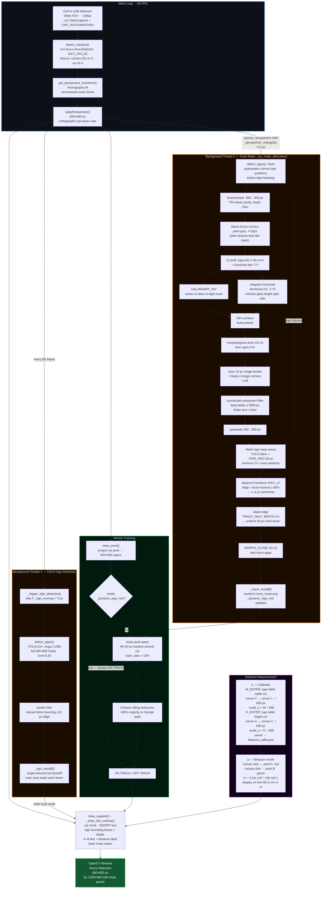

# System Architecture — Detailed

Paste into https://mermaid.live to render.

```mermaid
flowchart TD
    CAM["GoPro USB Webcam\nWide FOV · ~1080p\ncv2.VideoCapture + CAP_AVFOUNDATION"]

    %% ── Main pipeline ────────────────────────────────────────────────
    subgraph MAIN["Main Loop  ·  ~25 FPS"]
        direction TB
        CAM --> DETECT["detect_markers()\ncv2.aruco.ArucoDetector  DICT_4X4_50\nreturns: corners IDs 0–3 · car ID 4"]
        DETECT --> HOMO["get_perspective_transform()\nhomography M\nrecomputed every frame"]
        HOMO --> WARP["warpPerspective()\n600×600 px\northographic top-down view"]
    end

    %% ── Vehicle tracking ─────────────────────────────────────────────
    subgraph VT["Vehicle Tracking"]
        direction TB
        WPT["warp_point()\nproject car pixel → 600×600 space"]
        SROI{"inside\n_dynamic_sign_rois?"}
        PIXEL["mask pixel query\n40×40 px window around car\ntrack_ratio > 10%"]
        DB["8-frame rolling debounce\n>60% majority to change state"]
        STATUS["ON TRACK / OFF TRACK"]
        WPT --> SROI
        SROI -->|"yes — always ON TRACK"| STATUS
        SROI -->|"no"| PIXEL --> DB --> STATUS
    end

    %% ── YOLO background thread ───────────────────────────────────────
    subgraph T1["Background Thread 1 — YOLO Sign Detection"]
        direction TB
        TRIG1["_trigger_sign_detection()\nskip if _sign_running = True"]
        DS["detect_signs()\nYOLOv11n  imgsz=1280\nfull 600×600 frame  conf=0.40"]
        BF["border filter\ndiscard bbox touching ±10 px edge"]
        SR["_sign_result[0]\nsingle-element list handoff\nmain loop reads each frame"]
        TRIG1 --> DS --> BF --> SR
    end

    %% ── Mask background thread ───────────────────────────────────────
    subgraph T2["Background Thread 2 — Track Mask  _run_mask_detection()"]
        direction TB
        FYOLO["detect_signs()  fresh\nguarantees correct sign positions\nbefore tape blanking"]
        DOWN["downsample  600→300 px\n75% fewer pixels, faster Otsu"]
        BCORNER["blank ArUco corners\npaint gray  r=22px\n(dark stickers look like track)"]
        CLAHE["CLAHE  clipLimit=2  tile=4×4\n+ Gaussian blur  7×7"]
        OTSU["Otsu  BINARY_INV\nworks on dark-on-light track"]
        ADAPT["Adaptive threshold\nblockSize=51  C=8\ncatches glare-bright right side"]
        OR["OR-combine\ndual-polarity"]
        MORPH["morphological close 13×13\nthen open 5×5"]
        BORDER["clear 15 px image border\n+ blank 4 image corners r=45"]
        CC["connected-component filter\nkeep blobs ≥ 3000 px\ndrops text / noise"]
        UP["upsample  300→600 px"]
        TAPE["blank sign+tape areas\nYOLO bbox + TAPE_PAD=20 px\nremoves T/+ cross artefacts"]
        RIDGE["distanceTransform  DIST_L2\nridge = local maxima ≥ 85%\n→ 1–4 px centerline"]
        DIL["dilate ridge\nTRACK_HALF_WIDTH=14\n→ uniform 28 px track band"]
        SEAL["MORPH_CLOSE  15×15\nseal micro-gaps"]
        MR["_mask_result[0]\nsaved to track_mask.png\n_dynamic_sign_rois updated"]
        FYOLO --> DOWN --> BCORNER --> CLAHE
        CLAHE --> OTSU & ADAPT
        OTSU & ADAPT --> OR --> MORPH --> BORDER --> CC --> UP
        UP --> TAPE --> RIDGE --> DIL --> SEAL --> MR
        FYOLO -->|"sign bboxes"| TAPE
    end

    %% ── Distance measurement ─────────────────────────────────────────
    subgraph DIST["Distance Measurement"]
        direction TB
        KCAL["k — Calibrate\nW_ENTER: type table width cm\n  corner 0 → corner 1  =  600 px\n  scale_x = W ÷ 600\nH_ENTER: type table height cm\n  corner 0 → corner 3  =  600 px\n  scale_y = H ÷ 600\nsaved → distance_calib.json"]
        PMEAS["p — Measure mode\nmouse click → point A  red\nmouse click → point B  green\nd = √( (dx·sx)² + (dy·sy)² )\ndisplay on line AB in cm or m"]
    end

    %% ── Display ──────────────────────────────────────────────────────
    HUD["draw_warped() + _draw_dist_overlay()\ncar circle · ON/OFF text\nsign bounding boxes + labels\nA–B line + distance label\ntrack mask status"]
    SCREEN["OpenCV Window\nArUco Detection\n600×600 px\n(or 1200×600 with mask panel)"]

    %% ── Connections ──────────────────────────────────────────────────
    WARP -->|"every 8th frame"| TRIG1
    WARP -->|"startup / perspective shift\n_perspective_changed() >15 px"| FYOLO
    WARP --> WPT
    WARP --> HUD
    MR --> PIXEL
    SR -->|"main loop reads"| HUD
    STATUS --> HUD
    KCAL --> PMEAS --> HUD
    HUD --> SCREEN

    %% ── Styles ───────────────────────────────────────────────────────
    style MAIN fill:#0d1117,color:#cdd9e5,stroke:#4a90d9,stroke-width:2px
    style T1   fill:#1a0d00,color:#cdd9e5,stroke:#e67e22,stroke-width:2px
    style T2   fill:#1a0d00,color:#cdd9e5,stroke:#e67e22,stroke-width:2px
    style DIST fill:#13001a,color:#cdd9e5,stroke:#9b59b6,stroke-width:2px
    style VT   fill:#001a0d,color:#cdd9e5,stroke:#27ae60,stroke-width:2px
    style SCREEN fill:#145a32,color:#fff,stroke:#27ae60,stroke-width:2px
```
