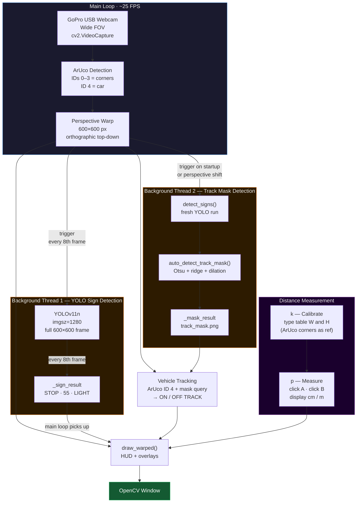

# System Architecture — High Level

Paste into https://mermaid.live to render.

```mermaid
flowchart TD
    CAM["GoPro USB Webcam\nWide FOV\ncv2.VideoCapture"]

    subgraph MAIN["Main Loop  ·  ~25 FPS"]
        CAM --> ARUCO["ArUco Detection\nIDs 0–3 = corners\nID 4 = car"]
        ARUCO --> WARP["Perspective Warp\n600×600 px\northographic top-down"]
    end

    subgraph T1["Background Thread 1 — YOLO Sign Detection"]
        direction LR
        YOLO["YOLOv11n\nimgsz=1280\nfull 600×600 frame"]
        -->|"every 8th frame"| SCACHE["_sign_result\nSTOP · 55 · LIGHT"]
    end

    subgraph T2["Background Thread 2 — Track Mask Detection"]
        direction LR
        FYOLO["detect_signs()\nfresh YOLO run"]
        --> MASKDET["auto_detect_track_mask()\nOtsu + ridge + dilation"]
        --> MCACHE["_mask_result\ntrack_mask.png"]
    end

    subgraph DIST["Distance Measurement"]
        direction LR
        CALIB["k  — Calibrate\ntype table W and H\n(ArUco corners as ref)"]
        --> MEASURE["p  — Measure\nclick A · click B\ndisplay cm / m"]
    end

    WARP -->|"trigger\nevery 8th frame"| YOLO
    WARP -->|"trigger on startup\nor perspective shift"| FYOLO
    WARP --> VT["Vehicle Tracking\nArUco ID 4 + mask query\n→ ON / OFF TRACK"]
    MCACHE --> VT
    WARP --> HUD["draw_warped()\nHUD + overlays"]
    SCACHE -->|"main loop picks up"| HUD
    VT --> HUD
    MEASURE --> HUD
    HUD --> SCREEN["OpenCV Window"]

    style MAIN fill:#1a1a2e,color:#eee,stroke:#4a90d9
    style T1   fill:#2d1b00,color:#eee,stroke:#e67e22
    style T2   fill:#2d1b00,color:#eee,stroke:#e67e22
    style DIST fill:#1a002d,color:#eee,stroke:#9b59b6
    style SCREEN fill:#145a32,color:#fff,stroke:#27ae60
```
